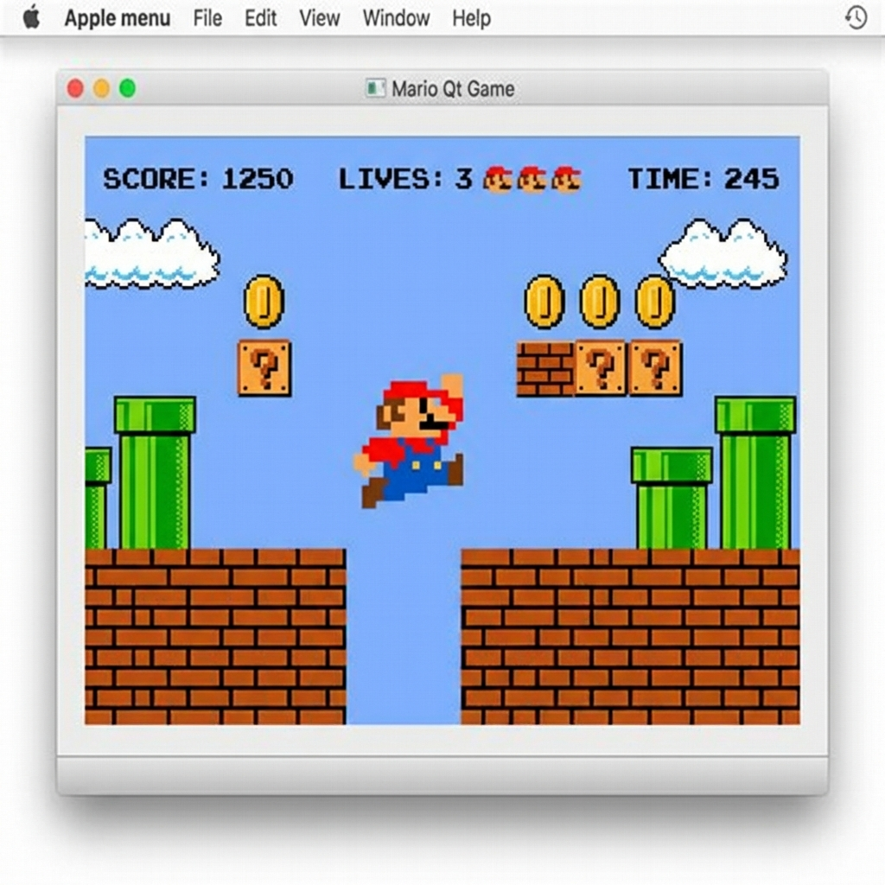
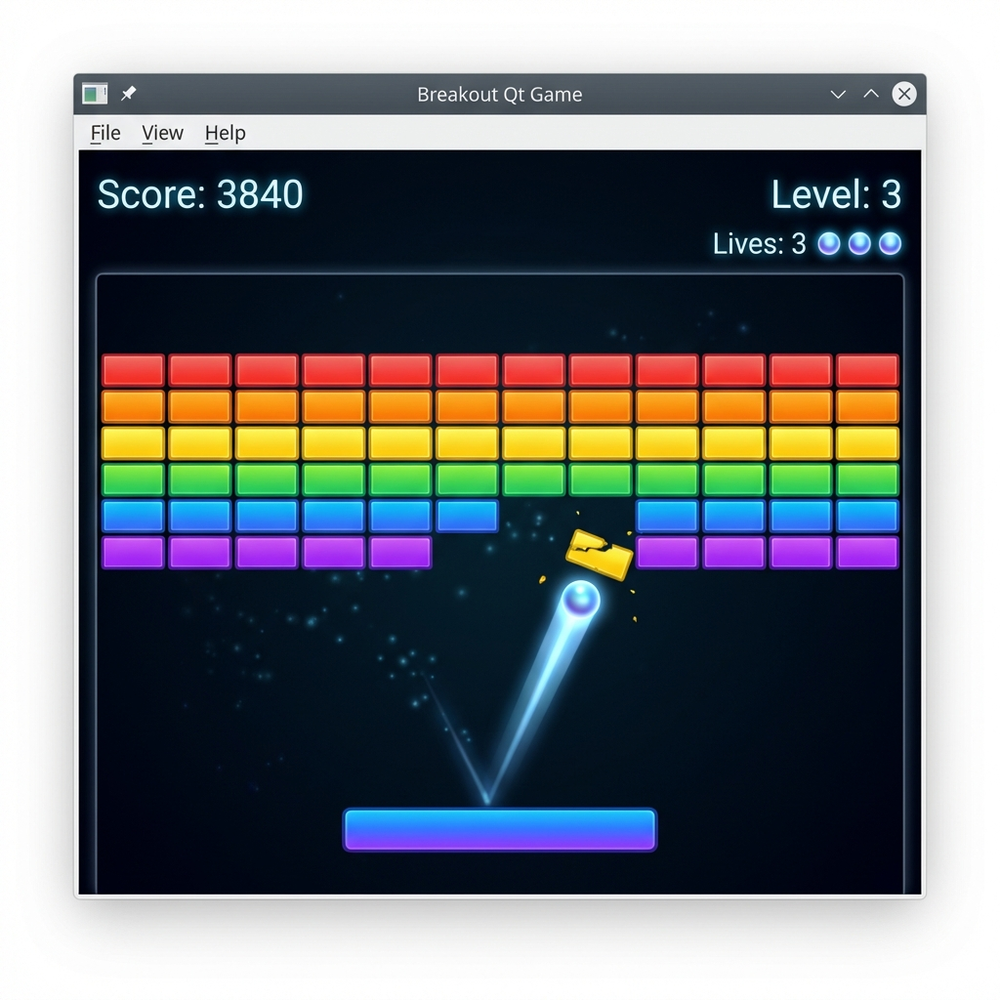

====================================================
🐚 Conch — C++ Vibe Coding Framework
====================================================

.. image:: https://img.shields.io/badge/C%2B%2B-23-blue.svg
   :alt: C++23

.. image:: https://img.shields.io/badge/License-MIT-green.svg
   :alt: License

.. image:: https://img.shields.io/badge/CMake-3.25%2B-blue.svg
   :alt: CMake

.. image:: https://img.shields.io/badge/Platform-Windows%20%7C%20macOS%20%7C%20Linux%20%7C%20iOS%20%7C%20Android-lightgrey
   :alt: Platforms

.. image:: https://github.com/ConchFeng/conch-cpp/actions/workflows/ci.yml/badge.svg
   :alt: CI/CD Pipeline
   :target: https://github.com/ConchFeng/conch-cpp/actions/workflows/ci.yml

.. image:: https://codecov.io/gh/ConchFeng/conch-cpp/branch/main/graph/badge.svg
   :alt: Code Coverage
   :target: https://codecov.io/gh/ConchFeng/conch-cpp

.. image:: https://img.shields.io/badge/Unit%20Tests-✓-brightgreen.svg
   :alt: Unit Tests

.. image:: https://img.shields.io/badge/Integration%20Tests-✓-brightgreen.svg
   :alt: Integration Tests

.. image:: https://img.shields.io/badge/Vibe%20Coding-Ready-ff69b4.svg
   :alt: Vibe Coding Ready

.. image:: https://img.shields.io/badge/AI%20Agents-Friendly-blueviolet.svg
   :alt: AI Agent Friendly

**The Ultimate C++ Vibe Coding Framework — Build production-grade apps by just describing what you want.**

🎵 **Vibe Code. Ship Fast. Scale Forever.**

💡 What is Vibe Coding?
========================

**Vibe Coding** is the revolutionary approach to software development coined by `Andrej Karpathy <https://twitter.com/karpathy/status/1886192184808149383>`_:

    *"There's a new kind of coding I call 'vibe coding', where you fully give in to the vibes, embrace exponentials, and forget that the code even exists."*

**Conch** is the first C++ framework designed from the ground up for the Vibe Coding era:

- 🎯 **Describe, Don't Code**: Tell AI what you need, and watch it build
- 🧩 **Modular Architecture**: Every component is self-contained and AI-friendly
- ⚡ **Zero Friction**: From idea to running code in minutes, not weeks
- 🔄 **Instant Iteration**: Change requirements? AI regenerates in seconds

🚀 The Vibe Coding Experience
==============================

**Traditional C++ Development:**

.. code-block:: text

   Week 1-2: "Let me configure CMake..." 😫
   Week 3:   "Why won't Conan work?" 🤯
   Week 4:   "IDE setup is killing me..." 💀
   Week 5:   "Finally writing actual code..." 😴
   
**Vibe Coding with Conch:**

.. code-block:: text

   You:    "I need a WebSocket server for real-time trading"
   AI:     ✨ Creates production-ready server in 30 seconds
   You:    "Add Redis caching"
   AI:     ✨ Integrates caching layer seamlessly
   You:    "Deploy to Docker"
   AI:     ✨ Generates multi-stage Dockerfile
   
   Total time: 5 minutes. ☕

✨ Why Conch is Perfect for Vibe Coding
========================================

1. **Crystal-Clear Structure**
   
   AI agents understand exactly where to put new code. No guessing, no conflicts.

2. **One-Command Everything**
   
   ``./build.sh``, ``./run.sh``, ``./test.sh`` — AI loves predictable interfaces.

3. **Self-Documenting Patterns**
   
   Modern C++23 with consistent conventions means AI generates *correct* code.

4. **Production-Ready Templates**
   
   Pre-built apps for games, trading, chat, RTC — perfect starting points for any project.

🌟 What Makes Conch Different?
===============================

**Conch** is a modern, enterprise-grade C++ cross-platform framework that gets you from idea to deployed application at lightning speed. Whether you're building:

- 🎮 **Games** (Snake, Mario, Breakout — all included!)
- 💰 **Trading Systems** (HFT engines, stock simulators)
- 💬 **Real-Time Communication** (Chat servers, meeting gateways)  
- 🌐 **Network Services** (TCP/UDP servers, WebSocket)
- 📊 **Data Processing** (Analytics, monitoring)

**Conch has you covered** with a battle-tested architecture, modern tooling, and zero boilerplate.

🎯 Why Choose Conch?
====================

❌ **Before Conch:**
   - Weeks spent on project setup
   - CMake configuration hell
   - Dependency management nightmares
   - IDE incompatibilities
   - No CI/CD templates
   
✅ **With Conch:**
   - **5-Second Setup**: Clone, ``./build.sh``, done.
   - **Any IDE**: VS2022, Xcode, CLion, VSCode — all pre-configured
   - **Modern Dependencies**: Conan 2.x handles everything automatically
   - **Production-Ready CI/CD**: Jenkins, GitHub Actions, GitLab CI templates included
   - **Docker Ready**: Multi-stage builds, docker-compose orchestration

🤖 Built for Humans & AI Agents
=================================

**Conch is designed for the future of software development: Human + AI collaboration.**

The framework's modular architecture and standardized structure make it the perfect environment for **rapid, AI-assisted development**:

🔹 **Modular by Design**
   Every component is self-contained and follows consistent patterns, making it easy for both humans and AI agents to:
   
   - Understand project structure instantly
   - Add new modules without breaking existing code
   - Integrate third-party libraries seamlessly
   - Scale from prototype to production

🔹 **AI-Agent Friendly**
   - **Crystal-Clear Structure**: Consistent naming, organization, and patterns across all modules
   - **Self-Documenting Code**: Modern C++23 features and clear interfaces
   - **Automated Everything**: Build, test, and deploy with single commands
   - **Intelligent Dependency Management**: Conan handles complexity automatically

🔹 **Rapid Prototyping → Production**
   Whether you're working solo, with a team, or collaborating with AI coding assistants:
   
   1. **Describe** what you want to build
   2. **Generate** modular components using AI or templates
   3. **Integrate** into the framework with minimal boilerplate
   4. **Deploy** with production-ready CI/CD pipelines

🔹 **From Idea to World-Class Product**
   - **Day 1**: Prototype your idea with AI-generated components
   - **Week 1**: Refine and test with automated quality checks
   - **Month 1**: Deploy to production with enterprise-grade infrastructure
   - **Beyond**: Scale effortlessly with battle-tested architecture

💡 **Example AI Collaboration Workflow:**

.. code-block:: text

   Human: "I need a WebSocket server for real-time notifications"
   AI Agent: Creates src/servers/notification_server/
             ├── main.cpp (WebSocket server logic)
             ├── CMakeLists.txt (Auto-integrated)
             └── tests/ (Unit tests included)
   
   Result: Production-ready server in minutes, not days.

**The future of development is collaborative, modular, and lightning-fast. Conch makes it happen.**

⚡ Quick Start
==============

**Get running in 3 commands:**

.. code-block:: bash

   git clone https://github.com/ConchFeng/conch-cpp.git
   cd conch-cpp
   ./build.sh

**That's it.** You now have:

- ✅ HFT trading engine
- ✅ RTC meeting gateway  
- ✅ Stock trading simulator
- ✅ Multi-client chat system
- ✅ Snake game (CLI + Qt GUI)
- ✅ Mario platformer game (Qt)
- ✅ Breakout arcade game (Qt + OpenGL)
- ✅ Unit tests + benchmarks

All built, all tested, all running.

🎮 See It In Action
===================

**Experience the power of cross-platform Qt development with our demo games:**

Mario Qt - Classic Platformer
------------------------------

A full-featured 2D platformer built with Qt6 and modern C++, featuring:

✨ **Physics engine** with realistic jumping and collision detection  
✨ **Level system** with procedurally loaded platforms and obstacles  
✨ **Retro pixel art** rendering with smooth animations  
✨ **Score tracking** and lives system  

Breakout Qt - Modern Arcade Game
---------------------------------

A gorgeous OpenGL-powered brick-breaking game showcasing advanced graphics:

✨ **OpenGL rendering** with hardware acceleration  
✨ **Particle effects** and motion trails  
✨ **Rainbow brick patterns** with gradient effects  
✨ **Progressive difficulty** with multiple levels  

Both games demonstrate the framework's ability to build polished, production-ready applications with minimal code.

📦 What's Included?
===================

Pre-Built Applications
-----------------------

=========== ================================= ============== ===================
Category    Application                       Technology     Platforms
=========== ================================= ============== ===================
**Games**   Snake Game (CLI)                  Terminal UI    macOS, Linux
**Games**   Snake Game (Qt)                   Qt6 Widgets    Win, macOS, Linux
**Games**   Mario Qt (Platformer)             Qt6 + Physics  Win, macOS, Linux
**Games**   Breakout Qt (Arcade)              Qt6 + OpenGL   Win, macOS, Linux
**Finance** Stock Trading Simulator           Portfolio Mgmt Win, macOS, Linux
**Network** Chat Server                       libuv TCP      Win, macOS, Linux
**Network** Chat Client                       Async I/O      Win, macOS, Linux
**HFT**     Trading Engine                    High-Perf      Win, macOS, Linux
**RTC**     Meeting Gateway                   WebRTC Ready   Win, macOS, Linux
**Desktop** Pro Desktop App                   Qt6 Cross-Plat Win, macOS, Linux
**Mobile**  iOS Native App                    UIKit          iOS only
**Mobile**  Android Native App                JNI            Android only
=========== ================================= ============== ===================

.. note::
   **Snake CLI** requires Unix terminal APIs and is not available on Windows. 
   Windows users can use **Snake Qt** instead for a graphical experience.

Foundation Libraries
--------------------

- **foundation**: Logging, threading, utilities
- **network**: High-performance networking (libuv)
- **quant_core**: Quantitative finance models
- **media_core**: RTC/Meeting infrastructure
- **ui_kit**: Qt6 UI components

Development Tools
-----------------

✅ **Multi-IDE Support**
   - Visual Studio 2022 (Windows)
   - Xcode (macOS)
   - CLion (Linux)
   - VSCode (All platforms)

✅ **CI/CD Pipelines**
   - Jenkins (Declarative pipeline)
   - GitHub Actions (Matrix builds)
   - GitLab CI (Multi-stage)

✅ **Containerization**
   - Dockerfile (Multi-stage production)
   - docker-compose (Service orchestration)

✅ **Documentation**
   - Doxygen (API docs with diagrams)
   - Auto-generation scripts

✅ **Testing**
   - GTest (Unit tests)
   - Google Benchmark (Performance)
   - Coverage reports (gcovr)

🏗️ Architecture
================

Clean, modular, scalable:

.. code-block:: text

   conch-cpp/
   ├── src/
   │   ├── libs/              # Reusable libraries
   │   ├── servers/           # Backend services
   │   └── apps/              # End-user applications
   ├── tests/                 # Unit tests + benchmarks
   ├── scripts/               # Build automation
   ├── .github/workflows/     # CI/CD pipelines
   └── docker/                # Containerization

🚀 Usage Examples
=================

**Run a Chat Server:**

.. code-block:: bash

   ./run.sh chat_server
   # Server listening on port 8888

**Connect Chat Clients:**

.. code-block:: bash

   ./run.sh chat_client
   # Start typing to chat!

**Trade Stocks:**

.. code-block:: bash

   ./run.sh stock_trader
   # $100K virtual portfolio, 8 US stocks

**Play Snake:**

.. code-block:: bash

   ./run.sh snake_cli      # Terminal version
   ./run.sh snake_qt       # Qt GUI version

**Play Mario:**

.. code-block:: bash

   ./run.sh mario_qt       # Classic platformer

**Play Breakout:**

.. code-block:: bash

   ./run.sh breakout_qt    # OpenGL arcade game

🛠️ Build Your Own App
=======================

**Add a new application in 3 steps:**

1. Create directory: ``src/apps/my_app/``
2. Add ``CMakeLists.txt`` (5 lines)
3. Run ``./build.sh``

**Example CMakeLists.txt:**

.. code-block:: cmake

   add_executable(my_app main.cpp)
   target_link_libraries(my_app 
       PRIVATE foundation spdlog::spdlog)

Done. Your app is integrated into the framework.

🌟 Technology Stack
===================

========================  =============
Component                 Technology
========================  =============
Language                  **C++23**
Build System              **CMake 3.25+**
Package Manager           **Conan 2.x**
Desktop UI                **Qt6**
Mobile (iOS)              Native (UIKit)
Mobile (Android)          Native (JNI)
Logging                   **spdlog**
Networking                **libuv**
Testing                   **GTest**
Benchmarking              **Google Benchmark**
Documentation             **Doxygen**
CI/CD                     Jenkins, GitHub Actions
Containerization          **Docker**
========================  =============

📊 Production-Ready Features
=============================

✅ **Cross-Platform**
   - Windows, macOS, Linux (desktop)
   - iOS, Android (mobile native)

✅ **Enterprise Build System**
   - Conan 2.x dependency management
   - CMake presets for all environments
   - One-command builds

✅ **Multi-IDE Support**
   - Pre-configured for 4 major IDEs
   - Just open and code

✅ **Automated Testing**
   - Unit tests with GTest
   - Benchmarks with Google Benchmark
   - Coverage reports with one command

✅ **CI/CD Ready**
   - GitHub Actions workflows
   - Jenkins declarative pipelines
   - GitLab CI configurations

✅ **Docker Deployment**
   - Multi-stage builds (small images)
   - docker-compose orchestration
   - Production-ready containers

✅ **API Documentation**
   - Doxygen auto-generation
   - Call graphs, UML diagrams
   - One-command: ``./scripts/generate_docs.sh``

🎓 Perfect For
==============

✅ **Startups**: Ship MVPs in days, not months  
✅ **Enterprises**: Production-ready architecture  
✅ **Indie Developers**: Focus on features, not plumbing  
✅ **Students**: Learn modern C++ best practices  
✅ **Game Devs**: Cross-platform game framework  
✅ **FinTech**: HFT/trading infrastructure built-in  

📚 Documentation
================

- **Quick Start Guide**: `See above ↑`
- **API Documentation**: Run ``./scripts/generate_docs.sh``
- **Contributing**: See `CONTRIBUTING.md <CONTRIBUTING.md>`_
- **Build Scripts**: See `scripts/ <scripts/>`_

🤝 Contributing
===============

We love contributions! See `CONTRIBUTING.md <CONTRIBUTING.md>`_ for:

- Code style guidelines
- Pull request process
- Development setup
- Testing requirements

📄 License
==========

MIT License - Use it, modify it, ship it. See `LICENSE <LICENSE>`_.

🌟 Show Your Support
====================

If you find Conch useful, give us a ⭐ on GitHub!

💬 Community
============

- **Issues**: `GitHub Issues <https://github.com/ConchFeng/conch-cpp/issues>`_
- **Discussions**: `GitHub Discussions <https://github.com/ConchFeng/conch-cpp/discussions>`_

---

**Built with ❤️ for the C++ community**

*Don't just code. Ship.*
